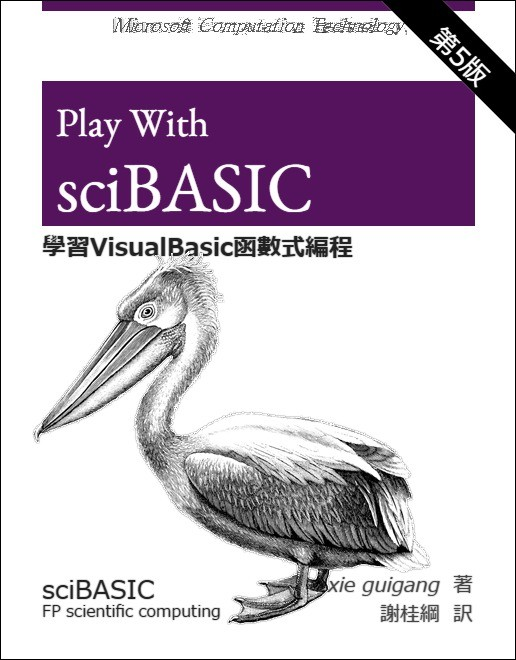

# Play With sciBASIC

## About this book
The series of articles in this book is designed to adjust your way of thinking to functional thinking, so that you can think about common problems in a new perspective and improve your daily coding work. This series describes the concept of functional programming, the framework of functional programming running in the ``VisualBasic`` language, functional programming languages running on the ``CLR``, and some directions for the future of language design. This series is primarily geared towards understanding the way ``VisualBasic`` and its abstract tiers work, but developers who lack experience in functional language use.

> In computer science, functional programming is a programming paradigm—a style of building the structure and elements of computer programs—that treats computation as the evaluation of mathematical functions and avoids changing-state and mutable data. It is a declarative programming paradigm, which means programming is done with expressions or declarations instead of statements.[^1]

A Metaphor picked from IBM developerworks

假如您是位伐木工人，如果您拥有最好的斧子，那您将会是林场中最能干的伐木工人。忽然有一天，有人向您展示并推荐一个新型伐木工具，电锯。这个销售人员很善于推销，于是您购买了电锯，但不知道如何使用。于是您就参照以前的模式来用，举起电锯用力地挥向树木。您很快就会得出结论，电锯这种新工具只不过是一种时尚，最后还是改用斧子来砍树。这时，有人过来告诉您如何正确使用电锯。
您可以参考这个故事，但是要把电锯 替换为函数式编程。这是个全新的编程范式，并不像学习一门新语言那么简单。毕竟，语言语法只是细节问题。难点在于学习不同的思维 方式。这就是我的切入点 — 电锯使用者与函数式程序员。[^2]

## Features for Functional Programming

The ``VisualBasic`` language doing support for the ``Functional Programming`` as better as its fully support on the ``OOP`` or ``Imperative Programming``. And in my opinion, the ``VisualBasic`` have some great language feature which makes powerful supports for the ``Functional Programming``, and here in this book I want to talking about the ``Functional Programming`` style in ``VisualBasic`` from these language features:

1. ``Standard Module``
2. ``Extension Method & Pipeline``
3. ``Lambda Expression``
4. ``Generic``
5. ``Operator Overrides & Natural Programming``
6. ``Linq & Parallel``

--------

[^1]: https://en.wikipedia.org/wiki/Functional_programming
[^2]: https://www.ibm.com/developerworks/cn/java/j-ft1/index.html
[^3]: https://www.ibm.com/developerworks/cn/java/j-ft20/